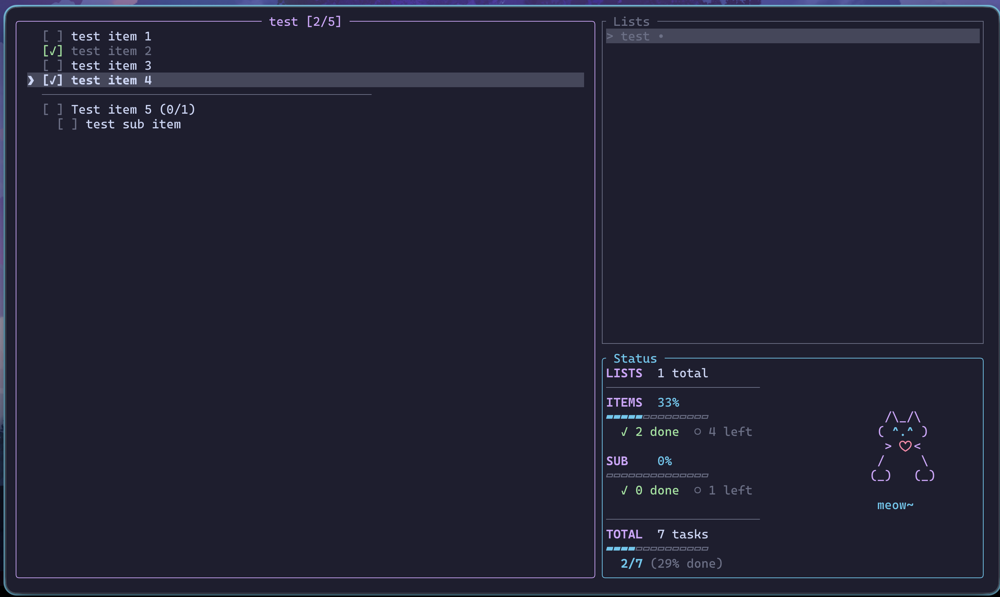

# Rudo

A fast terminal todo list written in rust!

## Install

With cargo:

```bash
cargo install --git https://github.com/Yahddyyp/Rudo
```

Or from source:

```bash
git clone https://github.com/Yahddyyp/Rudo
cd Rudo
cargo install --path .
```

### Path Setup

If the `rudo` command is not found after installation, ensure your cargo bin directory is in your PATH:

**For Zsh / Bash:**
Add this to your `~/.zshrc` or `~/.bashrc`:
```bash
export PATH="$HOME/.cargo/bin:$PATH"
```

**For Fish:**
Add this to your `~/.config/fish/config.fish`:
```fish
fish_add_path $HOME/.cargo/bin
```

## Usage



```bash
rudo                  # open the TUI
rudo list             # list tasks in the active list
rudo lists            # show all lists
rudo add Buy milk     # add a task (no quotes needed)
rudo done 1           # mark task 1 done
rudo undo 1           # uncheck task 1
rudo rm 1             # remove task 1
rudo use Work         # switch active list
rudo status           # completion stats
```

## TUI Keybinds

| Key | Action |
|-----|--------|
| `i` | Add item |
| `s` | Add sub-item |
| `h` | Add header |
| `-` | Add separator |
| `E` | Edit selected |
| `d` | Delete selected |
| `u` | Uncheck item |
| `Enter` | Toggle check |
| `j/k` | Move cursor |
| `Tab` | Switch panel |
| `/` | Search |
| `v` | Toggle completed |
| `Esc` | Menu |

## Data

State is stored at `~/.config/rudo/appdata.json`.

## License

MIT
